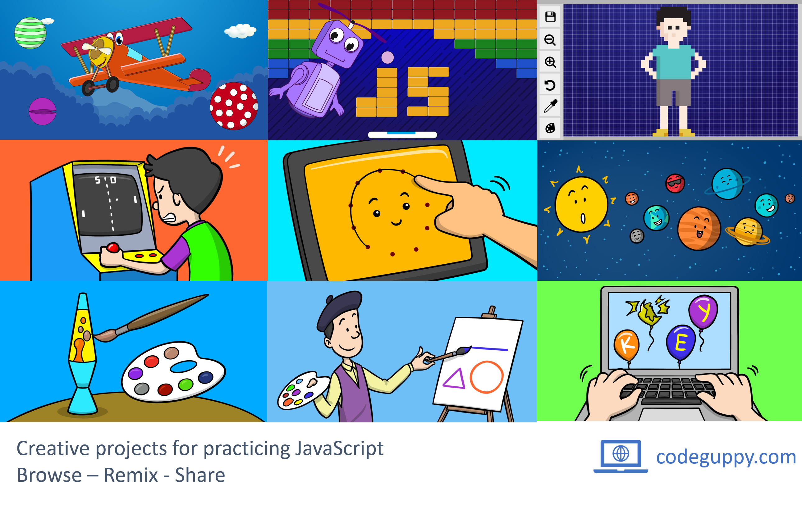

p5.js SceneManager
==================

p5.js SceneManager is used by countless of p5.js developers across the world to add scene management capabilities to their p5.js sketches. If you are using 'p5.js SceneManager' in your project, it will be great if you share the details of your project with me (I may even feature your project on this page).

News
----

- The free coding platform [codeguppy.com](https://codeguppy.com) is using a modified version of 'p5.js SceneManager'. codeguppy.com is used in schools and coding clubs around the world. Check it out - is super cool!

[](https://codeguppy.com)


Description
-----------

p5.js SceneManager helps you create [p5.js](https://github.com/processing/p5.js) sketches with multiple states / scenes.
Each scene is a like a sketch within the main sketch. You focus on creating
the scene like a regular sketch and SceneManager ensure scene switching
routing the main setup(), draw(), mousePressed(), etc. events to the 
appropriate current scene.

Instead of putting all your code in the main setup() and draw() like this:

```JavaScript
function setup() {

}

function draw() {

}
```

... you put each scene code in the setup() and draw() methods of individual Scene classes:

```JavaScript
// Intro scene constructor function
function Intro()
{
    this.setup = function() {
    }

    this.draw = function() {
    }

    this.keyPressed = function() {
        // switch the scene
        this.sceneManager.showScene( Game );
    }
}

// Main games scene constructor function
function Game()
{
    this.setup = function() {
    }

    this.draw = function() {
    }
}
```

The SceneManager will provide you with methods necesary to switch to the appropriate scene and route the main p5.js events to your defined events.

Source Code
-----------

Source code is located in [lib/scenemanager.js](lib/scenemanager.js)


Demo Code
---------

For demo please check sample.html, sample_instance.html and game.html


Online demo
-----------

If you want to play with scenes in an online playground, just go to [codeguppy.com/code.html](https://codeguppy.com/code.html) code editor.

If you want to try the classical standalone demostrations of SceneManager, then check-out the following examples:

| Code | Online version |
|------|----------------|
| [sample.html](https://github.com/mveteanu/p5.SceneManager/blob/master/sample.html) | [sample.html](https://mveteanu.github.io/p5.SceneManager/sample.html) |
| [sample_instance.html](https://github.com/mveteanu/p5.SceneManager/blob/master/sample_instance.html) | [sample_instance.html](https://mveteanu.github.io/p5.SceneManager/sample_instance.html) |
| [game.html](https://github.com/mveteanu/p5.SceneManager/blob/master/game.html) | [game.html](https://mveteanu.github.io/p5.SceneManager/game.html) |


Future development
------------------

The library can be further extended with features such as:
- routing of more / all events to the appropriate scene class
- running of multiple scenes in parallel (overlapped)
- running of multiple scenes in parallel in individual areas of a bigger canvas

If you are interested in these features, please open an issue here on GitHub.


License
-------

[CC BY 2.0](https://creativecommons.org/licenses/by/2.0/)

VMA
